# Gaijinn Parallel Execution Case Study

**Institutional Quality Gate for Multi-Agent Software Development**

| Field | Value |
|-------|-------|
| Document version | 2.0 |
| Date | 2026-06-16 |
| Artifact class | Technical case study / whitepaper |
| Audience | Engineering directors, CTOs, technical design partners |
| Status | Phase 1 + Phase 2 complete — tiny-service gateway lap + Gaijinn monorepo dogfood |

---

## Executive Summary

Multi-agent coding frameworks promise parallel velocity. In practice, they collide: autonomous workers modify overlapping functional surfaces, Git cannot see implicit coupling, and merge pipelines fail silently until a human untangles worktree history.

Gaijinn closes this loop with four enforced layers:

1. **Topological guardrails** — Ollivier-Ricci curvature on the import graph surfaces Dark Bridges (κ ≤ −0.30) that static DAGs miss.
2. **GIV contract firewalls** — per-worker write scopes in isolated git worktrees (`SCOPE_STRICT`, `HANDOFF_ONLY`).
3. **Council Transaction Bus** — cross-boundary mutations become immutable `TX-HT-*` tickets, not sibling trespasses.
4. **Upstream CI gate** — `POST /api/v1/preflight` blocks integration merges unless isolation is clean and `transaction_bus_synchronized` is true.

On a controlled two-worker sprint against `tiny-python-service`, Gaijinn achieved **1.0 merge convergence**, **zero merge conflicts**, and **zero blocked branches** after gateway-mode handoff coordination—versus **0.50 convergence** when an unconstrained agent trespassed into a sibling path.

**Phase 2 (this document, Section 5)** dogfoods the same pipeline on the **171-node Gaijinn monorepo** with **four concurrent copy-mode workers**, **92 shadow-bridge handoff gateways**, and a live cross-cutting ticket **`TX-HT-6D0B24`** (billing → preflight API). Result: **validation pass rate 1.0 (4/4)**, **zero sibling trespass**, **transaction bus synchronized**, and **0.8889 structural convergence**—an honest ledger that flags three no-op workers as `PREFLIGHT_BLOCKED` because their deltas were already integrated, not a vanity 1.0.

---

## Section 1: The Parallel Agent Collision Problem

### The context

Frameworks such as CrewAI, AutoGen, and naive LangGraph swarms partition tasks across concurrent LLM instances. Each worker receives a prompt, operates in a sandbox, and produces diffs. The economic thesis is simple: *N agents ⇒ ~N× throughput*.

### Why Git is structurally blind

Version control tracks file-level history. It does not model:

- **Hidden functional coupling** — shared constants, implicit internal APIs, test-to-implementation contracts.
- **Runtime assumptions** — import side effects, module-level initialization order.
- **Cross-directory dependencies** — a test file that requires a service-layer constant the test worker cannot legally author.

When two agents run simultaneously in isolated directories, they routinely satisfy local acceptance criteria by writing into each other's territory. Syntax passes. Linters pass. Merge fails—or worse, silently regresses behavior.

### The economic failure mode

In a naive swarm, a single trespass does not merely block one file. It forces a human engineer to:

1. Diff multiple worktrees against an integration base.
2. Determine which mutation was authoritative.
3. Re-run tests on a manually reconciled branch.

The automation ROI collapses. Parallelism becomes **negative leverage**: you pay for agent tokens *and* senior engineer recovery time.

---

## Section 2: Technical Breakdown — Exam 1 (The Trespass Incident)

### Incident profile

| Parameter | Value |
|-----------|-------|
| Target | `examples/tiny-python-service` |
| Workers | 2 (live Grok Build, `grok-composer-2.5-fast`) |
| Mode | Legacy weld partitioning (pre-gateway) |
| Date | 2026-06-16 |

### What happened

**Worker-001** was assigned test-layer scope. To satisfy a localized dependency, it reached beyond its GIV-allowed paths and modified `tiny_service/service.py`—a file owned by the service work unit.

The merge integrity harness (`collect` → `validate-worker` → `merge-grid`) detected the violation at merge time:

| Gate | Result |
|------|--------|
| `path_allowlist` | **FAILED** — trespass on `tiny_service/service.py` |
| `scope_isolation` | **FAILED** — sibling write forbidden |
| Merge eligibility | Worker-001 **BLOCKED** |

### Measured outcome

| Metric | Value |
|--------|-------|
| Structural convergence (before remediation) | **0.50** |
| Merged workers | 1 of 2 |
| Blocked workers | 1 (trespass) |
| Merge conflicts | 0 (blocked before contamination) |
| Human recovery cost | High — manual worktree archaeology |

**Interpretation:** Gaijinn correctly *prevented* bad code from entering the integration branch. The 0.50 score is not a product failure—it is an honest accounting of partial compliance. In frameworks without GIV enforcement, the same trespass would have merged and produced a silent behavioral regression.

---

## Section 3: The Gaijinn Solution

### 3.1 Differential geometry as a partitioning oracle

Before any agent runs, Gaijinn executes:

```
gaijinn scan → gaijinn analyze → gaijinn plan
```

The analyze phase computes **Ollivier-Ricci curvature** (κ) on the repository import graph. Edges with κ ≤ −0.30 are classified as **Dark Bridges**—high-risk couplings invisible to flat module boundaries.

On the Gaijinn monorepo itself (`gaijinn audit .`):

| Mode | Atomic weld blocks | Largest weld (files) | Max parallel workers |
|------|-------------------|----------------------|----------------------|
| Legacy (union-find weld) | 2 | 40 | 48 |
| Gateway (`GAIJINN_HANDOFF_GATEWAYS=1`) | 0 | — | 46 |

**Parallel Efficiency Delta:**

- 2 atomic weld blocks eliminated
- 44 files unlocked from blunt serialization arrays
- 92 handoff gateway edges identified
- `efficiency_delta.gateway_recommended: true`

The audit command surfaces this as the **Parallel Efficiency Matrix**—a lead magnet that calculates structural debt before a single agent token is spent.

### 3.2 GIV contract tokens — runtime write firewalls

Each worker receives a **GIV (Governed Intent Vector)** compiled from the blueprint:

```json
{
  "allowed_paths": ["tests/test_api.py"],
  "denied_paths": [],
  "denied_commands": ["git push", "git merge", ...],
  "sibling_denied_paths": ["tiny_service/service.py"]
}
```

Workers execute inside **git worktrees**—disposable branches with hard path boundaries. `validate-worker` calls `detect_trespasses()` against the GIV at merge time. Trespass is not advisory; it is **merge-blocking**.

### 3.3 Council Transaction Bus — asynchronous cross-boundary coordination

When `GAIJINN_HANDOFF_GATEWAYS=1`, Dark Bridge couplings become **HANDOFF_ONLY** gateways—not atomic welds that serialize 40-file blocks.

**Protocol flow (Victory Lap Gateway, 2026-06-16):**

```
worker-001 (tests scope)
  │
  ├─ Adds test importing DONE_STATUS from tiny_service.service
  ├─ Cannot edit tiny_service/service.py (GIV firewall)
  └─ Emits HANDOFF_TRANSACTION_REQUEST → TX-HT-84348F
         │
         ▼
Council Bus (append-only council.jsonl + handoff-queue.json)
         │
         ▼
worker-002 (service scope)
  │
  ├─ Ingests HANDOFF INGEST block at grid-spawn
  ├─ Adds DONE_STATUS = "done" to tiny_service/service.py
  └─ Posts HANDOFF_TRANSACTION_RECEIPT → bus synchronized
```

**Ticket record (abbreviated):**

| Field | Value |
|-------|-------|
| `ticket_id` | `TX-HT-84348F` |
| `source_worker_id` | `worker-001` |
| `target_work_unit_id` | `WU-002` |
| `target_file` | `tiny_service/service.py` |
| `required_mutation_context` | Add `DONE_STATUS = "done"` after imports |

### 3.4 Upstream CI gate — institutional enforcement

`POST /api/v1/preflight` evaluates merge-pipeline artifacts before integration:

| Check | Source artifact |
|-------|-----------------|
| Workspace isolation | `validated.json[worker_id].gates.path_allowlist.trespasses` |
| Transaction bus | `handoff-queue.json.transaction_bus_synchronized` |
| Pending tickets | `handoff-queue.json.pending_tickets` |

| HTTP status | `status_code` | Meaning |
|-------------|---------------|---------|
| 200 | `PREFLIGHT_CLEARED` | Safe to merge |
| 422 | `PREFLIGHT_REJECTED` | Trespass or unresolved TX-HT tickets |

Plug-and-play GitHub Action: `.github/workflows/gaijinn-gate.yml`

---

## Section 4: Empirical Results — The Final Exam

### Victory Lap Gateway (`/tmp/gaijinn-victory-lap-gateway`)

| Parameter | Value |
|-----------|-------|
| Target | `examples/tiny-python-service` |
| Workers | 2 (live Grok Build) |
| Mode | `GAIJINN_HANDOFF_GATEWAYS=1`, real agents (no mock grid) |
| Model | `grok-composer-2.5-fast` |

### Sprint runtime

| Worker | Scope | Elapsed | Status |
|--------|-------|---------|--------|
| worker-001 | `tests/test_api.py` | **30.8s** | completed |
| worker-002 | `tiny_service/service.py` | **34.6s** | completed |

### Handoff bus telemetry

| Metric | Value |
|--------|-------|
| Tickets raised | 1 |
| Tickets resolved | 1 |
| Pending tickets | 0 |
| `transaction_bus_synchronized` | **true** |
| Scaffold tickets dropped (parser hardening) | 2 |

### Merge governance score

```json
{
  "convergence": 1.0,
  "atomic_weld_units": 0,
  "merged_workers": 2,
  "blocked_workers": 0,
  "conflicted_workers": 0,
  "handoff_isolation": true,
  "transaction_bus_synchronized": true,
  "merge_order": ["worker-002", "worker-001"],
  "merge_latency_ms": 1000,
  "validation_pass_rate": 1.0
}
```

### Quality harness

| Metric | Value |
|--------|-------|
| Unit tests (repository) | **241** collected |
| Preflight gate tests | 9 passed |
| Merge conflicts | **0** |
| Integration branch contamination | **0** (blocked at validation + CI gate) |

### Head-to-head: Exam 1 vs Final Exam

| Dimension | Exam 1 (trespass) | Final Exam (gateway) |
|-----------|-------------------|----------------------|
| Cross-boundary strategy | Direct sibling write | `TX-HT-84348F` handoff ticket |
| Convergence | 0.50 | **1.0** |
| Blocked workers | 1 | 0 |
| Atomic weld blocks | N/A (legacy) | **0** |
| Human merge recovery | Required | **None** |

---

## Section 5: Enterprise Monorepo Scaling Telemetry

### Phase 2 dogfood profile

| Parameter | Value |
|-----------|-------|
| Target | Gaijinn monorepo (`gaijinn/integration`) |
| Graph profile | **171 code nodes** · **152 import edges** · **92 shadow bridges** (κ ≤ −0.30) |
| Audit mode | Gateway recommended (`GAIJINN_HANDOFF_GATEWAYS=1`) |
| Workers | **4** concurrent (`worker-001`–`004`) |
| Isolation mode | **Filesystem copy fallback** (no per-worker `.git`; hash/`filecmp` delta tracking) |
| Model | `grok-composer-2.5-fast` |
| Sprint completion | **4/4** workers completed (~**163s** wall per worker) |
| Work units | `WU-PH2-001` billing · `WU-PH2-002` api/preflight · `WU-PH2-003` handoff/merge helpers · `WU-PH2-004` tests |
| Date | 2026-06-16 |

### Parallel Efficiency Matrix (monorepo self-audit)

`gaijinn audit .` on the production Gaijinn tree quantifies the **40-file atomic serialization trap** that naive union-find welding would impose:

| Dimension | Legacy (union-find weld) | Gateway (`GAIJINN_HANDOFF_GATEWAYS=1`) |
|-----------|--------------------------|----------------------------------------|
| Atomic weld blocks | **2** | **0** |
| Largest weld (files) | **40** | — |
| Total files in atomic welds | **44** | — |
| Files unlocked from welds | — | **44** |
| Handoff gateway edges (shadow bridges) | — | **92** |
| Max parallel workers | 49 | 47 |
| Work units partitioned | 54 | 54 |

**Interpretation:** Without gateway mode, two blunt atomic welds would serialize **44 files**—including a **40-file cluster**—forcing sequential agent execution across deeply coupled CLI, supervisor, and test surfaces. Gateway partitioning replaces those welds with **92 HANDOFF_ONLY edges**, preserving lane discipline while allowing four workers to sprint concurrently on billing, API, merge helpers, and tests.

### Cross-cutting transaction: `TX-HT-6D0B24`

Worker-001 owned `aoc_supervisor/aoc_supervisor/billing.py` only. Preflight API extensions required sibling-owned paths (`api.py`, `preflight.py`). The worker emitted a structured handoff instead of trespassing:

| Field | Value |
|-------|-------|
| `ticket_id` | **`TX-HT-6D0B24`** |
| `source_worker_id` | `worker-001` |
| `target_work_unit_id` | `WU-PH2-002` |
| `target_file` | `aoc_supervisor/aoc_supervisor/api.py` |
| `required_mutation_context` | Import settlement localization APIs from `billing.py`; extend `POST /api/v1/preflight`; wire idempotent `deduct_deployment_fee()` at grid-spawn |

**Bus telemetry (final ledger):**

| Metric | Value |
|--------|-------|
| Tickets raised | 1 |
| Tickets resolved | 1 |
| Pending tickets | 0 |
| Scaffold tickets dropped (regex hardening) | **4** |
| `transaction_bus_synchronized` | **true** |
| Sibling trespass violations | **0** |

The scaffold filter discarded four parser echoes from worker `output.log` streams—noise that would have polluted the transaction bus in a less hardened ingest path.

### Copy-mode instrumentation and validation hardening

Phase 2 exposed two copy-mode blind spots, both closed without re-spending agent tokens:

1. **Collect filesystem fallback** — When worker sandboxes lack `.git`, `changed_files_filesystem()` compares scoped paths against the session baseline via hash/`filecmp`, feeding `collected.json` and the handoff queue.
2. **Localized validation** — `validate-worker` injects `GAIJINN_PROJECT_ROOT` and monorepo `PYTHONPATH` so pytest respects isolated sandboxes; scoped acceptance targets map each worker's `allowed_paths` to relevant test modules.

### Merge governance score (Phase 2 final)

```json
{
  "convergence": 0.8889,
  "validation_pass_rate": 1.0,
  "merged_workers": 1,
  "blocked_workers": 3,
  "conflicted_workers": 0,
  "handoff_isolation": true,
  "transaction_bus_synchronized": true,
  "merge.validation_pass_rate_full": true,
  "merge.no_blocked": false,
  "merge_order": ["worker-003"]
}
```

### Why 0.8889 is the correct enterprise score

A lesser governance layer would pad convergence to **1.0** when validation is green. Gaijinn does not.

| Signal | Phase 2 value | Meaning |
|--------|---------------|---------|
| `validation_pass_rate` | **1.0** | All four workers passed every gate (path allowlist, scope isolation, handoff protocol, scoped pytest) |
| `transaction_bus_synchronized` | **true** | `TX-HT-6D0B24` resolved; zero pending TX-HT tickets |
| `handoff_isolation` | **true** | Zero sibling path writes across 171 nodes |
| `convergence` | **0.8889** | Three workers returned **`PREFLIGHT_BLOCKED`** at merge—copy-mode workers with **zero fresh filesystem deltas** because billing, api/preflight, and test changes were **already structurally integrated** in earlier merge passes |

For a CTO, this distinction is the product proof: the gate is not a passive stamp. It evaluates the **delta of every line** in every isolation sandbox. Redundant merge attempts are flagged honestly rather than silently skipped.

### Phase 1 vs Phase 2 head-to-head

| Dimension | Phase 1 (tiny-service gateway) | Phase 2 (Gaijinn monorepo) |
|-----------|-------------------------------|------------------------------|
| Code nodes | 12 (example service) | **171** |
| Concurrent workers | 2 | **4** |
| Handoff ticket | `TX-HT-84348F` | **`TX-HT-6D0B24`** |
| Isolation | Git worktree | **Copy fallback + filesystem diff** |
| Validation pass rate | 1.0 | **1.0** |
| Convergence | 1.0 (fresh deltas) | **0.8889** (honest no-op detection) |
| Trespass violations | 0 | **0** |
| Atomic weld blocks (audit) | 0 (gateway) | **0** (gateway) |

---

## Architecture: Closed Infrastructure Loop

```mermaid
flowchart LR
  subgraph upstream [Upstream Diagnostics]
    A[gaijinn audit]
    A --> B[Parallel Efficiency Matrix]
  end

  subgraph runtime [Runtime Enforcement]
    C[gaijinn plan + GIV]
    D[git worktree workers]
    E[Council Transaction Bus]
    C --> D
    D --> E
  end

  subgraph merge [Merge Integrity]
    F[collect]
    G[validate-worker]
    H[merge-grid]
    I[governance.json]
    F --> G --> H --> I
  end

  subgraph ci [CI Boundary]
    J[POST /api/v1/preflight]
    K[gaijinn-gate.yml]
    J --> K
  end

  B --> C
  E --> F
  I --> J
```



---

## What This Means for Engineering Leadership

Gaijinn is not a prompt wrapper. It is a **zero-trust gatekeeper policy** for agent-generated code:

1. **Audit before spend** — `gaijinn audit` quantifies parallel efficiency loss from atomic welds.
2. **Enforce at runtime** — GIV contracts block trespass before merge, not after production.
3. **Coordinate asynchronously** — handoff tickets replace sibling writes without serializing entire clusters.
4. **Gate at CI** — preflight hook prevents integration branch contamination upstream.

An engineering director running hundreds of concurrent agent executions gets a mathematical guarantee: **non-compliant worker output never merges**. The convergence score is an honest ledger, not a marketing metric.

---

## Reproduction

```bash
# Structural audit (lead magnet)
gaijinn audit . --json-only

# Gateway victory lap (live agents — requires grok on PATH)
GAIJINN_HANDOFF_GATEWAYS=1 bash scripts/dev/victory-lap-tiny.sh

# CI preflight smoke test
curl -s -X POST http://127.0.0.1:8000/api/v1/preflight \
  -H "Content-Type: application/json" \
  -d '{"session_id":"victory","worker_id":"worker-001","project_path":"/tmp/gaijinn-victory-lap-gateway"}' | jq .
```

---

## Appendix A: Artifact Index

| Artifact | Path |
|----------|------|
| Merge governance | `.gaijinn/merge/governance.json` |
| Handoff queue | `.gaijinn/merge/handoff-queue.json` |
| Per-worker validation | `.gaijinn/merge/validated.json` |
| Audit report | `.gaijinn/audit-report.json` (or stdout via `--json-only`) |
| Council ledger | `.gaijinn/bridge/council.jsonl` |
| Preflight endpoint | `aoc_supervisor/aoc_supervisor/api.py` → `/api/v1/preflight` |
| GitHub gate | `.github/workflows/gaijinn-gate.yml` |

---

## Appendix B: Phase 3 Roadmap

- Worktree-first dogfood policy (eliminate copy-mode toolchain shadowing)
- `ALREADY_MERGED` classification for zero-delta copy-mode workers (convergence semantics)
- Production supervisor URL wiring for enterprise CI (`GAIJINN_SUPERVISOR_URL`)

---

*Neural Draft LLC — Gaijinn. Council entries through #215. Trade secret notice applies to curvature partitioning and handoff gateway algorithms.*