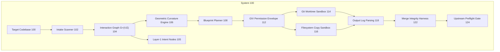
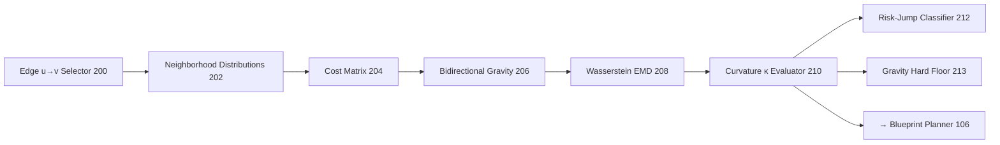
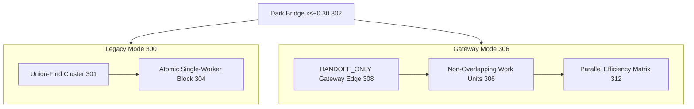
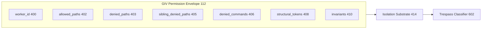

# Patent figures — Mermaid (canonical numerals)

**Inventor:** Amir Khodabakhsh · California, US  
**Terminology:** GIV = Agent Intent Vector (not "Grit")  
**Supersedes:** `~/Desktop/patentvisuals.jpeg` (Grit typo)

Reference numerals match `USPTO-PATENT-APPLICATION-DRAFT.md`.

---

## FIG. 1 — Deployment loop (100–124)

---

## FIG. 2 — Curvature pipeline (200–213)

---

## FIG. 3 — Legacy weld vs gateway mode (300–312)

---

## FIG. 4 — GIV permission envelope (400–416)

---

## FIG. 5 — Transaction bus (500–510)

---

## FIG. 6 — Merge pipeline (600–610)

---

## FIGS. 7–13 (summary)

| Fig | Mermaid anchor | Key numerals |
|-----|----------------|--------------|
| 7 | Supervisor | 700 metrics → 704 GIV gate → 708 circuit breaker |
| 8 | Extraction | 800 repo → 802 modality → 810 graph state |
| 9 | Topology | 900 typed node → 906 overlap → 908 reject |
| 10 | Gravity | 1000 score → 1002 floor → 1008 preflight GIV block |
| 11 | Federated | 1100 vault A/B → 1108 cross-system TX → 1110 validator |
| 12 | ORI | 1200 resource → 1204 read tracker → 1208 commit reject |
| 13 | Constraints | 1300 invariants → 1304 envelope → 1310 preflight reject |

Full SVG filing visuals: `figures/fig01-deployment-loop.svg`, `figures/fig04-giv-envelope.svg`, `figures/patent-figures-sheet.svg`.