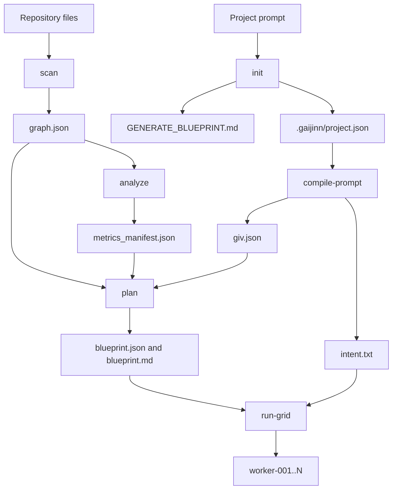

> **SUPERSEDED — see `docs/vault/` INTERNAL**

# Gaijinn Concepts

Gaijinn turns a project prompt and repository scan into constrained worker handoffs. The core flow is deterministic: initialize state, scan the repository graph, compute graph risk, compile intent, plan isolated work units, then create worker directories.

## Blueprint

A blueprint is the implementation plan Gaijinn writes to `.gaijinn/blueprint.json` and `.gaijinn/blueprint.md`. It contains the project goal, assumptions, work units, dependencies, and risks. The JSON form is validated and used by `run-grid`; the Markdown form is readable by humans.

Blueprints enforce non-overlapping write scopes. If two work units would write overlapping paths, blueprint validation fails instead of producing ambiguous worker ownership.

## Work Unit

A work unit is one isolated task inside a blueprint. It has:

- `id` and `title` for stable assignment.
- `description` for the expected change.
- `allowed_paths` and `denied_paths` for write boundaries.
- `depends_on` for ordering.
- `acceptance_checks` for proof.
- `estimated_risk` of `low`, `medium`, or `high`.

`run-grid` distributes work units across workers in deterministic ID order.

## GIV

GIV means Agent Intent Vector. It is the worker intent contract written to `.gaijinn/giv.json` and rendered into `.gaijinn/intent.txt`.

The GIV captures allowed paths, denied paths, allowed commands, denied commands, capabilities, prohibitions, and invariants. It always includes safety defaults such as denying `git push`, forbidding destructive cleanup outside the workspace, and forbidding edits outside assigned paths.

## MOAT

MOAT is the prompt parser that turns the project prompt into work domains, capabilities, risk flags, and safety constraints. `compile-prompt` uses it to infer whether a project touches backend, frontend, auth, docs, tests, or other domains.

The result is not a final implementation plan. It is a structured intent profile used to constrain planning and worker handoffs.

## Gravity And Curvature

Gravity is a node-level score computed from graph connectivity, capability level, and side-effect risk. Nodes below the hard floor are automatically rejected because they are too risky or under-contextualized for normal parallel execution.

Curvature is an edge-level graph metric. Negative curvature marks a fragile transition between nodes. Gaijinn reports these edges as Shadow Bridges.

## Shadow Bridge

A Shadow Bridge is an edge whose curvature is negative or whose transition jumps from low-risk context to high-risk side effects. Shadow Bridges are important because they often indicate hidden coupling, deployment risk, security-sensitive paths, or state transitions that should be isolated.

Blueprint generation gives Shadow Bridge files dedicated work units when possible.

## Worker Grid

The worker grid is the set of generated worker handoff directories under `.gaijinn/workers/`. Each worker receives intent, metadata, assigned work units, and a README. The manifest records worker count, mode, and assignments.

The grid does not launch agents. It prepares isolated directories and contracts so agents or humans can work with clear boundaries.

## Worktree Isolation

When `run-grid` runs inside a clean Git worktree, Gaijinn creates Git worktrees for worker directories. Each worker gets a branch such as `gaijinn/worker-1`.

When the checkout is not a Git worktree or has uncommitted changes, Gaijinn uses copy mode. Copy mode preserves local work without forcing Git operations and is better for demos, acceptance runs, and dirty development trees.

