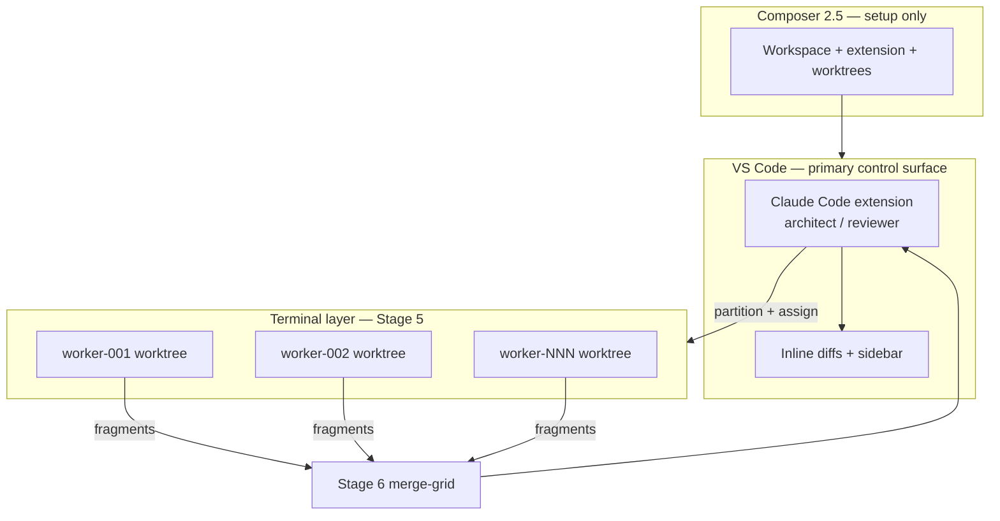

# Loom Factory Orchestration (Composer 2.5)

**Authority:** Agent execution contract for deterministic, stage-isolated factory runs.  
**Maps to:** `ui/loom-pipeline-intent-map.json`, `ui/loom-deliverable-intent-map.json`  
**Trigger phrase:** `run factory`  
**Repo root:** `/home/ghostmonday/Desktop/Loom`

---

## Execution Environment

The factory has **three control layers**. Do not conflate them.

| Layer | Surface | Role |
|-------|---------|------|
| **1 — Architect** | **VS Code Claude Code** (native IDE extension) | Primary controller. Reads the repo, runs stages 1–4 and 6–7 reasoning, reviews inline diffs, owns factory order and gates. |
| **2 — Coordinator** | **Composer 2.5** (setup agent) | Boots the arrangement: VS Code workspace, extension, env, worktrees, worker terminal layout. Does not replace the architect during a run. |
| **3 — Workers** | **Terminal agents** in isolated Loom worktrees | Parallel execution for Stage 5 only. One agent per work unit under `.gaijinn/workers/worker-NNN/`. No cross-worker edits. |

**VS Code Claude Code** and **IDE Claude Code** are the same surface here: VS Code is the IDE; Anthropic’s native extension (`anthropic.claude-code`) provides the sidebar, live file changes, and inline diffs. The **terminal `claude` CLI** is a separate interface — use it inside worker worktrees, not as the factory architect.



### Open the factory IDE

```bash
loom-vscode          # opens /home/ghostmonday/Desktop/Loom in VS Code
# or: code /home/ghostmonday/Desktop/Loom
```

First launch: spark icon → **Sign in** (Claude Pro/Max/Team or Console).

### Spawn worker terminals (Stage 5)

From the **VS Code integrated terminal** (architect stays in the extension panel):

```bash
cd /home/ghostmonday/Desktop/Loom
export PYTHONPATH="aoc-cli:aoc_supervisor:${PYTHONPATH}"
loom analyze
loom run-grid --workers 2    # creates .gaijinn/workers/worker-001, worker-002, ...
```

Open **one terminal per worker**, `cd` into that worker directory, run the assigned agent there. Architect reviews outputs via diffs in Claude Code; merge runs on `main` worktree only (Stage 6).

### Who does what

| Stage | Architect (VS Code CC) | Terminal workers |
|-------|------------------------|------------------|
| 1 Intent | ✓ intake, no codegen | — |
| 2 Claims | ✓ deterministic ledger review | — |
| 3 Blueprint | ✓ structure, no impl | — |
| 4 Partition | ✓ work units + curvature | — |
| 5 Grid | assigns + reviews | ✓ execute in worktrees |
| 6 Merge | ✓ validate + approve merge | — |
| 7 Handoff | ✓ reasoning audit + artifacts | — |

---

## Objective

Convert the current Loom system into a deterministic, repeatable factory pipeline where each stage is executed cleanly, in order, with no overlap or ambiguity.

---

## Core Principle

Each stage is isolated, deterministic, and produces a complete artifact before handing off to the next stage.

No stage is allowed to:

* infer missing inputs
* modify previous stage outputs
* skip validation

---

## Pipeline Definition

### Stage 1 — Intent Intake

* **Input:** user intent
* **Output:** structured intent object
* **Constraints:**
  * no code generation
  * no assumptions beyond user input

**Code binding**

| Field | Value |
|-------|-------|
| API | `POST /api/v1/intent-forge/sessions` |
| Module | `aoc_supervisor/intent_forge_service.py` |
| Entrypoint | `IntentForgeService.create_session` |
| Intent action | `intake.start_session` |
| Status | **shipped** |

---

### Stage 2 — Claims Ledger

* **Input:** intent + session evidence
* **Output:** claims ledger
* **Responsibilities:**
  * extract claims
  * assign stable IDs
  * detect contradictions
  * mark stale/superseded claims
* **Must be deterministic**

**Code binding**

| Field | Value |
|-------|-------|
| Module | `aoc_supervisor/claims_ledger.py` |
| Entrypoint | `build_claim_ledger` |
| Evidence | `aoc_supervisor/evidence_state.py` |
| Status | **shipped** (deterministic projection from forge session) |

---

### Stage 3 — Blueprint Generation

* **Input:** claims ledger (+ teleology deliberation)
* **Output:** blueprint
* **Responsibilities:**
  * define system structure
  * define components and dependencies
  * no implementation details

**Code binding**

| Field | Value |
|-------|-------|
| Deliberation | `GET /api/v1/blueprint/deliberate` → `aoc_supervisor/api.py:blueprint_deliberate` |
| Synthesis | `POST /api/v1/loom/blueprint/synthesize` → `loom_blueprint_synthesizer.py:synthesize_blueprint` |
| Gravity/curvature | `aoc_cli/blueprint.py`, `aoc_cli/gravity.py` |
| Artifact | `.gaijinn/blueprint.json` |
| Intent action | `blueprint.synthesize` |
| Status | **shipped** |

---

### Stage 4 — Work Unit Partitioning

* **Input:** blueprint
* **Output:** atomic work units
* **Responsibilities:**
  * partition into parallelizable units
  * enforce no hidden coupling
  * apply curvature / welding rules

**Code binding**

| Field | Value |
|-------|-------|
| Module | `aoc_supervisor/orchestrate_session.py` |
| Entrypoint | `OrchestrateSessionStore.prepare` |
| Intent action | `orchestrate.prepare` |
| Curvature/weld | `aoc_cli/gravity.py`, `aoc_cli/blueprint.py` |
| Status | **shipped** (requires `intent_forge_session_id` in production) |

---

### Stage 5 — Grid Execution

* **Input:** work units
* **Output:** generated code fragments
* **Responsibilities:**
  * assign agents per unit
  * enforce GIV constraints
  * no cross-unit leakage

**Code binding**

| Field | Value |
|-------|-------|
| Spawn | `POST /api/v1/grid/spawn` |
| GIV | `aoc_cli/giv.py` |
| Workers | `aoc_cli/helpers/workers.py` |
| Mock flag | `GAIJINN_MOCK_GRID=1` (tests) |
| Intent actions | `deploy.sprint`, `grid.poll_status` |
| Status | **shipped** |

---

### Stage 6 — Merge + Validation

* **Input:** code fragments
* **Output:** unified codebase
* **Responsibilities:**
  * merge deterministically
  * validate integrity
  * enforce all invariants
* **Gate:** `merge_pipeline.phase == "completed"`

**Code binding**

| Field | Value |
|-------|-------|
| CLI | `loom collect` → `loom validate-worker` → `loom merge-grid` |
| Module | `aoc_cli/helpers/merge.py` |
| Status probe | `merge_pipeline_status(project_root)` |
| Intent actions | `merge.run`, `merge.poll_status` |
| Status | **shipped** |

---

### Stage 7 — Continuation Handoff (LOOM-212)

* **Input:**
  * merged codebase
  * blueprint
  * merge report/status
  * claims ledger (if present)
  * repo state (HEAD, branch, dirty)
  * teleology receipt
* **Output:**
  * `.gaijinn/handoff/handoff.json`
  * `.gaijinn/handoff/handoff.md`
* **Responsibilities:**
  * run codebase audit through reasoning provider
  * generate structured continuation data
  * generate human-readable explanation
  * maintain deterministic output
* **Constraints:**
  * fail closed on provider error
  * no partial writes
  * all paths relative to `project_root`
  * idempotent (detect existing vs new)

**Code binding**

| Field | Value |
|-------|-------|
| CLI | `loom handoff [--session-id] [--project-root] [--force]` |
| Module | `aoc_cli/helpers/continuation_handoff.py` |
| Entrypoint | `write_handoff_artifacts` |
| LLM audit | `run_handoff_llm_audit` |
| Intent action | `deliverable.generate_handoff` |
| Status | **spec_only** — CLI registered; gather/audit/gate incomplete |

---

## Execution Rules (Composer Behavior)

Composer must:

1. Execute stages strictly in order
2. Never skip a stage
3. Never merge responsibilities across stages
4. Treat each stage as complete before proceeding
5. Use existing artifacts if already valid (idempotency)

---

## Agent Roles

| Role | Surface | Responsibility |
|------|---------|----------------|
| **Claude Code (VS Code)** | IDE extension sidebar | Architect: stage order, repo read, diff review, stages 1–4 and 6–7 |
| **Terminal agents** | worker worktrees | Grid workers: Stage 5 implementation only |
| **Composer 2.5** | setup session | Coordinate VS Code + worktrees + env; not the in-run architect |
| **Reasoning model** | via Claude Code / provider | Stage 7 handoff audit; optional teleology interpretation |

Stages 1–6 deterministic gates run in Loom Python/API. Probabilistic interpretation is confined to **Stage 7** and architect review — never in merge or GIV enforcement.

---

## Factory Mode Instructions

**Architect (VS Code Claude Code)** runs factory mode in the extension panel. **Workers** receive single-stage prompts in their worktree terminal only.

When running in factory mode:

* Do not ask for clarification unless input is missing
* Do not redesign architecture
* Do not refactor outside current stage
* Do not recreate existing files
* Only complete the current stage's responsibilities
* Architect does not implement Stage 5 code directly — assign to worker terminals
* Workers do not merge, partition, or write handoff artifacts

---

## Final Output Contract

A successful run produces:

1. Validated merged codebase
2. Complete continuation handoff:
   * structured JSON
   * readable markdown
3. No unresolved contradictions
4. Deterministic, repeatable output

---

## Command Trigger — `run factory`

When instructed **"run factory"**, Composer must:

1. Execute all stages in order
2. Stop on failure
3. Report completion state per stage

### Verify stages 1–6 (mirror smoke)

```bash
cd /home/ghostmonday/Desktop/Loom
export PYTHONPATH="aoc-cli:aoc_supervisor:${PYTHONPATH}"
export GAIJINN_MOCK_GRID=1 GAIJINN_FAKE_REASONING=1 GAIJINN_ALLOW_INSECURE_LOCAL=1
.venv/bin/python -m pytest tests/test_loom_mirror_forge.py -k flow.loom_full_pipeline_mock -q
```

### Verify stage 7 (when implemented)

```bash
.venv/bin/python -m pytest tests/test_continuation_handoff.py -q
loom handoff --json
```

### Factory completion report template

```
FACTORY RUN
- Stage 1 Intent Intake:     pass|fail|skip
- Stage 2 Claims Ledger:     pass|fail|skip
- Stage 3 Blueprint:         pass|fail|skip
- Stage 4 Partition:         pass|fail|skip
- Stage 5 Grid:              pass|fail|skip
- Stage 6 Merge:             pass|fail|skip
- Stage 7 Handoff:           pass|fail|skip
- Blocker: <none | stage + reason>
```

---

## End State

Loom is not a generator.

Loom is a **system factory** that produces:

* software
* structure
* continuation intelligence

All outputs must be immediately usable by:

* a human developer
* or another AI system